<div align="center">

#  Hey, I’m **Sowad Hossain**

<br>


<i>Friendly by default. Creative at heart. Obsessed with smooth UX and tidy code.</i>


</div>

<br>

### 🚀 About Me

```javascript
const sowad = {
    name: "Sowad Hossain",
    role: "Full-Stack Developer 💻",
    location: "🌍 Planet Earth (mostly online)",
    code: ["JavaScript", "Python", "Java", "C++", "TypeScript"],
    tools: ["React", "Node.js", "Docker", "Git", "VS Code"],
    passions: ["Web Development", "Automation", "Clean UI", "Open Source"],
    currently: "Turning caffeine into scalable SaaS and sleek dashboards ☕",
    learning: ["Next.js", "DevOps", "System Design"],
    quote: "If it works, ship it. If it breaks, learn fast and fix faster 🚀",
    funFact: "console.log() and I have a love-hate relationship 😄"
};
```

<br>

## ⚡ Highlights

<div align="center">

<a href="#"></a> <a href="#"></a> <a href="#"></a> <a href="#"></a> <a href="#"></a>


</div>

<br>

## 🧰 Tech Stack

<div align="center">

<p>
  
  
  
  
  
</p>
<p>
  
  
  
  
  
</p>


</div>

> *Full stack with a bias toward simplicity. If it’s not maintainable, it’s not done.*

<br><br>

## 🚀 Selected Work (Live Demos)

**🏋️‍♂️ Prime Fitness** — Fitness tracking & management with analytics dashboard. <a href="https://prime-fitness.sowadh.me/" target="_blank"></a>

**🛒 ShobShopping** — Clean e-commerce experience focused on speed and UX. <a href="https://shobshopping.com/" target="_blank"></a>

**🚀 10x** — Growth & ops tooling with automation backbone (SaaS). <a href="https://10x.sowadh.me/" target="_blank"></a>

**🏢 CondoGestoin** — Property management dashboard for residents & admins. <a href="https://condogestoin.sowadh.me/#/login" target="_blank"></a>

**👔 Fursume** — AI pet Resume and Travel Pass Builder (dev). <a href="https://dev.fursume.com/" target="_blank"></a>

**👕 Wardrobe** — Inventory management and billing softwere (mobile First) for Clothing brands (demo). <a href="http://wardrobe.sowadh.me/" target="_blank"></a>

➡️ **Explore the full portfolio** → [sowadh.me](https://sowadh.me)


## 🧪 Building Now

* **Bugination** — lightweight issue tracking & triage (WIP) → [bugination.sowadh.me](https://bugination.sowadh.me/)
* **Wardrobe** — Inventory management and billing softwere (mobile First) for Clothing brands (WIP) → [wardrobe.sowadh.me](http://wardrobe.sowadh.me/)


<br>

## 📊 GitHub Overview

<div align="center">







</div>


<br><br>

## 🪄 Contribution Graph

<div align="center">



</div>

<br>

## 🤙 Contact

<div align="center">

<a href="https://www.linkedin.com/in/sowad-hossain" target="_blank"></a> <a href="mailto:contact@sowadh.me" target="_blank"></a> <a href="https://sowadh.me/" target="_blank"></a>

</div>

<br>

## 🧠 Quote I like

> “I don't want to live in a world where someone else makes the world a better place better than we do.”
> — *Gavin Belson, Silicon Valley*


<div align="center">

<sub>Thanks for stopping by! If something sparks, let’s build it.</sub>

</div>
